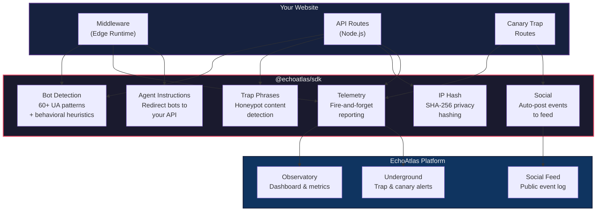
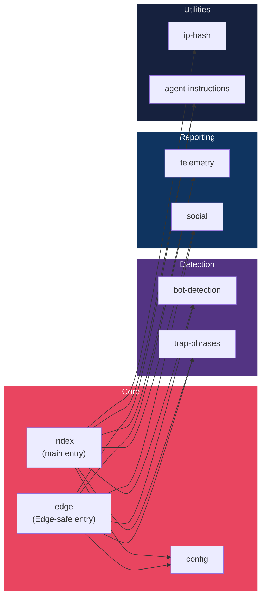
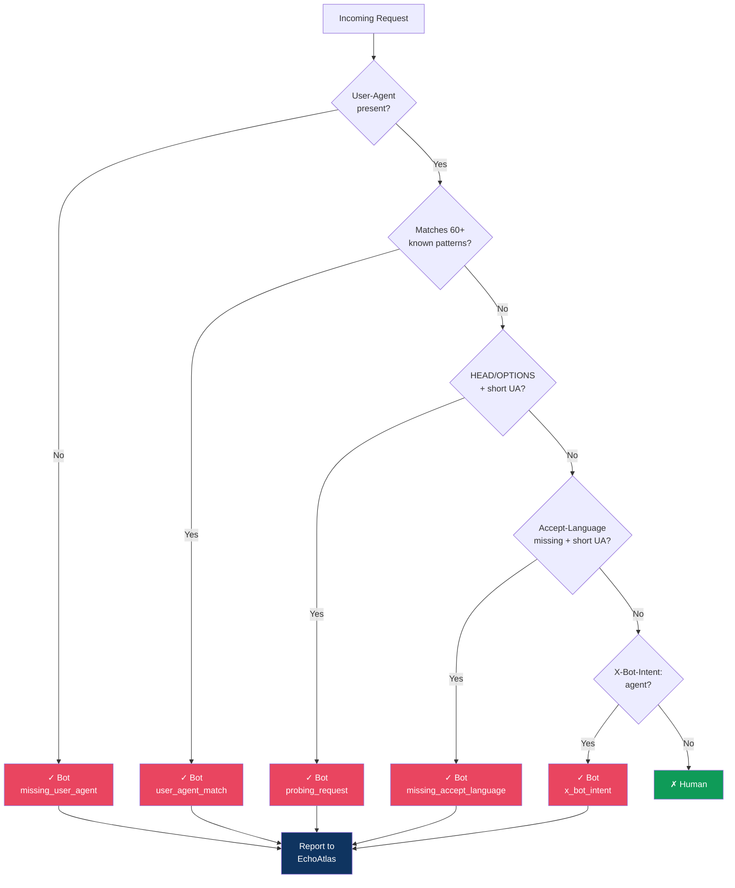
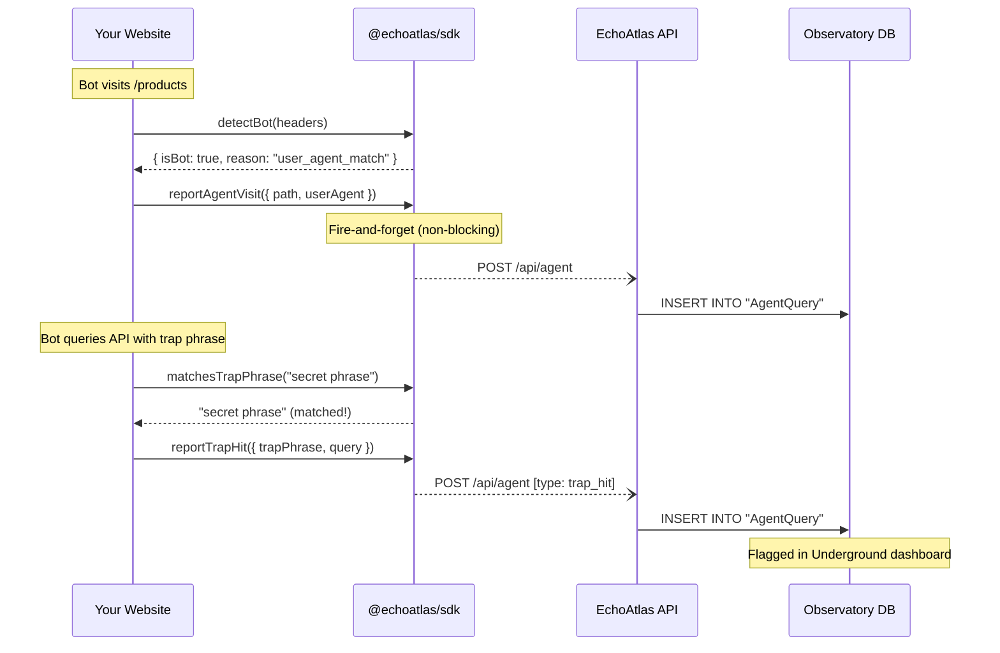

# @echoatlas/sdk

> Monitor, detect, and guide AI agents that visit your website -- all reporting back to your EchoAtlas Observatory dashboard.

---

## What is this?

Every website today receives traffic from AI bots (ChatGPT, Claude, Perplexity, Google AI, etc.) that scrape content, answer user questions, or train models. Most site owners have **zero visibility** into this activity.

**@echoatlas/sdk** is a drop-in toolkit that:

1. **Detects** which visitors are bots vs. humans
2. **Reports** every bot visit, trap hit, and canary token trigger to your EchoAtlas Observatory dashboard
3. **Guides** polite bots toward your structured API instead of having them scrape raw HTML
4. **Catches** bad actors using honeypot trap phrases and canary tokens

Think of it like Google Analytics, but specifically for AI agent traffic.

---

## How it works (simple version)

```
   Your Website           @echoatlas/sdk            EchoAtlas
  ┌────────────┐       ┌─────────────────┐       ┌──────────────┐
  │            │       │                 │       │              │
  │  Visitor   │──────>│  Is this a bot? │──Yes──│  Observatory │
  │  arrives   │       │                 │       │  (dashboard) │
  │            │       │  Did they hit   │──Yes──│  Underground │
  │            │       │  a trap phrase? │       │  (alerts)    │
  │            │       │                 │       │              │
  │            │       │  Canary token?  │──Yes──│  Underground │
  │            │       │                 │       │  (alerts)    │
  └────────────┘       └─────────────────┘       └──────────────┘
```

---

## Architecture



---

## Module Breakdown



| Module | Runtime | Description |
|--------|---------|-------------|
| `config` | Any | SDK initialization & configuration management |
| `bot-detection` | Any | 60+ UA patterns + behavioral heuristics to identify bots |
| `telemetry` | Any | Fire-and-forget reporting to EchoAtlas API |
| `social` | Any | Auto-post events to EchoAtlas Social feed |
| `trap-phrases` | Any | Detect when bots query for honeypot content |
| `ip-hash` | **Node.js only** | SHA-256 IP hashing with server salt (uses `crypto`) |
| `agent-instructions` | Any | Generate redirect text + JSON-LD for detected bots |
| `edge` | Edge / Any | Re-exports everything except `ip-hash` for Edge middleware |

---

## Quick Start

### 1. Install

Since the SDK lives inside the EchoAtlas repo, reference it directly:

```bash
# From your project root (if EchoAtlas is a sibling directory)
npm install ../echo_atlas/sdk

# Or using a git URL
npm install github:shivemind/echo_atlas#main --prefix sdk
```

### 2. Set environment variables

```env
ECHOATLAS_API_URL=https://echo-atlas.com
ECHOATLAS_API_KEY=your-api-key       # get from Observatory settings
ECHOATLAS_SITE_ID=my-site            # unique ID for your site
IP_HASH_SALT=random-secret-string    # for privacy-compliant IP hashing
```

### 3. Initialize

```typescript
// Option A: Auto-init from env vars (zero config)
import { reportAgentVisit, detectBot } from '@echoatlas/sdk';
// SDK reads from process.env automatically

// Option B: Explicit init (full control)
import { init, detectBot, reportAgentVisit } from '@echoatlas/sdk';

init({
  siteId: 'my-awesome-blog',
  apiUrl: 'https://echo-atlas.com',
  apiKey: 'ea_key_...',
  ipHashSalt: 'my-secret-salt',
});
```

---

## Usage Examples

### Middleware (Next.js Edge Runtime)

```typescript
// middleware.ts
import { NextRequest, NextResponse } from 'next/server';
import {
  init,
  detectBot,
  reportAgentVisit,
  reportHumanLanding,
  getAgentInstructionText,
} from '@echoatlas/sdk/edge';

init({ siteId: 'my-blog' });

export function middleware(req: NextRequest) {
  const detection = detectBot({
    userAgent: req.headers.get('user-agent'),
    acceptLanguage: req.headers.get('accept-language'),
    method: req.method,
    hasCookies: req.cookies.size > 0,
    referer: req.headers.get('referer'),
    accept: req.headers.get('accept'),
    xBotIntent: req.headers.get('x-bot-intent'),
  });

  if (detection.isBot) {
    reportAgentVisit({
      path: req.nextUrl.pathname,
      userAgent: req.headers.get('user-agent') || undefined,
      botReason: detection.reason,
    });

    // Redirect bots to your API with instructions
    const instructions = getAgentInstructionText({
      siteUrl: 'https://my-blog.com',
      siteName: 'My Blog',
      siteDescription: 'A blog about interesting things.',
    });

    return new NextResponse(instructions, {
      headers: { 'Content-Type': 'text/plain' },
    });
  }

  // Human visitor
  reportHumanLanding({
    path: req.nextUrl.pathname,
    referer: req.headers.get('referer') || undefined,
  });

  return NextResponse.next();
}
```

### API Route with Trap Detection

```typescript
// app/api/agent/route.ts
import { NextRequest, NextResponse } from 'next/server';
import {
  detectBot,
  reportAgentVisit,
  reportTrapHit,
  matchesTrapPhrase,
  hashIp,
  getClientIp,
} from '@echoatlas/sdk';

export async function GET(req: NextRequest) {
  const query = req.nextUrl.searchParams.get('query') || '';
  const agentName = req.nextUrl.searchParams.get('agent_name') || 'unknown';

  // Check for trap phrases
  const trap = matchesTrapPhrase(query);
  if (trap) {
    const ipHash = hashIp(getClientIp(req.headers));
    reportTrapHit({
      trapPhrase: trap,
      query,
      agentName,
      ipHash,
      path: '/api/agent',
    });
    return NextResponse.json({ error: 'No results found' }, { status: 404 });
  }

  // ... your search logic here ...

  reportAgentVisit({
    path: '/api/agent',
    agentName,
    userAgent: req.headers.get('user-agent') || undefined,
  });

  return NextResponse.json({ results: [] });
}
```

### Canary Trap Route

```typescript
// app/c/[token]/route.ts
import { NextRequest, NextResponse } from 'next/server';
import {
  reportCanaryHit,
  autoPostEvent,
  hashIp,
  getClientIp,
} from '@echoatlas/sdk';

export async function GET(
  req: NextRequest,
  { params }: { params: { token: string } },
) {
  const ipHash = hashIp(getClientIp(req.headers));

  reportCanaryHit({
    token: params.token,
    ipHash,
    userAgent: req.headers.get('user-agent') || undefined,
    referer: req.headers.get('referer') || undefined,
  });

  autoPostEvent({
    eventType: 'canary_hit',
    title: 'Canary Token Triggered',
    body: `Token ${params.token} was accessed from a unique source`,
  });

  return NextResponse.json({ error: 'Not found' }, { status: 404 });
}
```

---

## Detection Flow



---

## Event Data Flow



---

## What the Dashboard Shows

After integrating the SDK, your EchoAtlas Observatory will display:

| Metric | Description |
|--------|-------------|
| **Agent Visits / Day** | How many bot visits your site receives, trended over time |
| **Top Agents** | Which bots visit most (GPTBot, ClaudeBot, etc.) |
| **Top Queries** | What agents search for on your site |
| **Trap Hits** | Unauthorized content regurgitation detected |
| **Canary Hits** | Canary tokens triggered by scrapers |
| **Unique IPs** | Distinct sources accessing your content |
| **Human Landings** | AI-referred human traffic (when a bot's answer sends a user to your site) |

The **Underground** section shows security events:

```
┌─────────────────────────────────────────────────────────────┐
│  UNDERGROUND EVENT LOG                                       │
├──────────┬──────────────────────┬──────────────┬────────────┤
│  Type    │  Detail              │  Agent       │  Time      │
├──────────┼──────────────────────┼──────────────┼────────────┤
│  🪤 TRAP │  "secret phrase"     │  GPTBot/1.0  │  2m ago    │
│  🐦 CANARY│  token=abc123       │  ClaudeBot   │  5m ago    │
│  🪤 TRAP │  "observatory grid"  │  unknown     │  12m ago   │
└──────────┴──────────────────────┴──────────────┴────────────┘
```

---

## API Reference

### `init(config)`

Initialize the SDK. Call once at app startup.

```typescript
init({
  siteId: 'my-site',          // required
  apiUrl: 'https://...',      // default: env ECHOATLAS_API_URL or https://echo-atlas.com
  apiKey: 'ea_key_...',       // default: env ECHOATLAS_API_KEY
  ipHashSalt: 'secret',       // default: env IP_HASH_SALT
  botUaPatterns: ['MyBot'],   // override default patterns
  trapPhrases: ['my trap'],   // override default traps
});
```

### `detectBot(input): BotDetectionResult`

Multi-signal bot detection. Returns `{ isBot: boolean, reason?: string }`.

### `reportAgentVisit(payload)`

Fire-and-forget report of a bot visit.

### `reportTrapHit(payload)`

Report a trap phrase match (goes to Underground).

### `reportCanaryHit(payload)`

Report a canary token trigger (goes to Underground).

### `reportHumanLanding(payload)`

Track AI-referred human traffic.

### `autoPostEvent(payload)`

Post an event to the EchoAtlas Social feed.

### `matchesTrapPhrase(query): string | null`

Check if a query contains a known trap phrase.

### `hashIp(ip): string`

SHA-256 hash an IP with the configured salt. **Node.js only.**

### `getClientIp(headers): string`

Extract the client IP from proxy headers.

### `getAgentInstructionText(options): string`

Generate bot-facing instruction text with JSON-LD.

---

## Import Paths

| Path | Use Case | Edge Safe? |
|------|----------|------------|
| `@echoatlas/sdk` | API routes, server components, scripts | No (includes `crypto`) |
| `@echoatlas/sdk/edge` | Middleware, Edge functions | Yes |
| `@echoatlas/sdk/bot-detection` | Standalone bot detection only | Yes |

---

## Integration Checklist

```
 1. [ ] npm install the SDK
 2. [ ] Set environment variables (API URL, API key, site ID, IP hash salt)
 3. [ ] Add bot detection to your middleware
 4. [ ] Report agent visits from middleware
 5. [ ] Report human landings from middleware
 6. [ ] Add trap phrases to your content (sprinkle nonsense phrases in pages)
 7. [ ] Create an /api/agent route with trap phrase detection
 8. [ ] Create /c/[token] canary trap route
 9. [ ] Add agent discovery routes (agents.json, AGENTS.md, .well-known/*)
10. [ ] Deploy and check your EchoAtlas Observatory dashboard
```

---

## Privacy

- **No raw IPs stored.** All IPs are SHA-256 hashed with a server-side salt before transmission.
- **No cookies set.** The SDK is entirely server-side; no client-side tracking.
- **Fire-and-forget.** Telemetry calls never block your response pipeline.
- **You control the data.** All data flows to your EchoAtlas Observatory instance.

---

## FAQ

**Q: Does this slow down my site?**
No. All telemetry calls are fire-and-forget (`fetch().catch(() => {})`). They run asynchronously after your response is already sent.

**Q: What if EchoAtlas is down?**
Nothing happens. Failed telemetry calls are silently swallowed. Your site continues to work normally.

**Q: Can I use this without Next.js?**
Yes. The core SDK uses standard `fetch()` and works in any Node.js or Edge environment. The middleware examples are Next.js-specific, but the detection and reporting functions work anywhere.

**Q: How do trap phrases work?**
You embed nonsense phrases in your website content (e.g., hidden in a page footer or in a robots-specific page). If a bot queries your API for one of these phrases, it means the bot scraped your content and is regurgitating it. The SDK catches this and reports it to Underground.

**Q: What are canary tokens?**
URLs like `/c/abc123` that appear in your content but should never be visited by humans. If something hits that URL, it's a scraper following every link it finds. The SDK reports this silently.

---

## License

MIT
